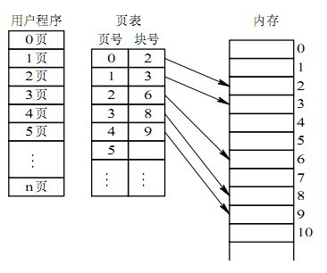
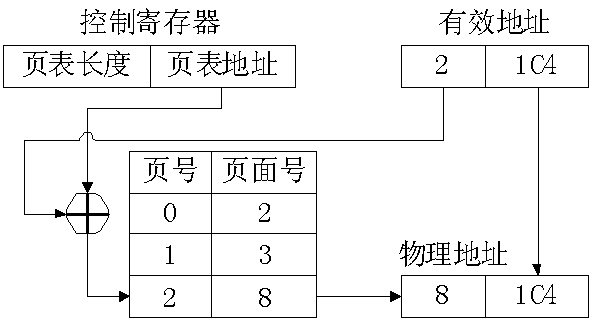
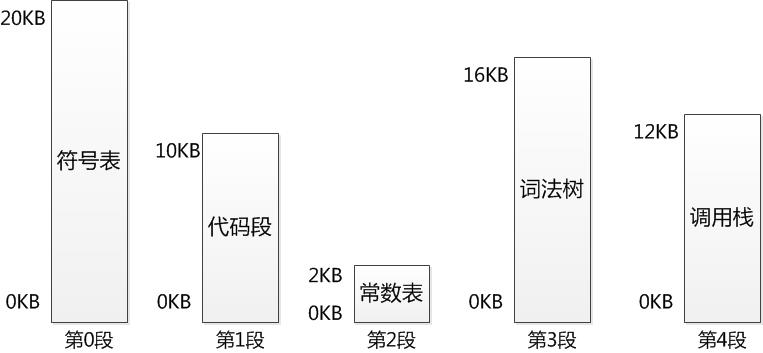
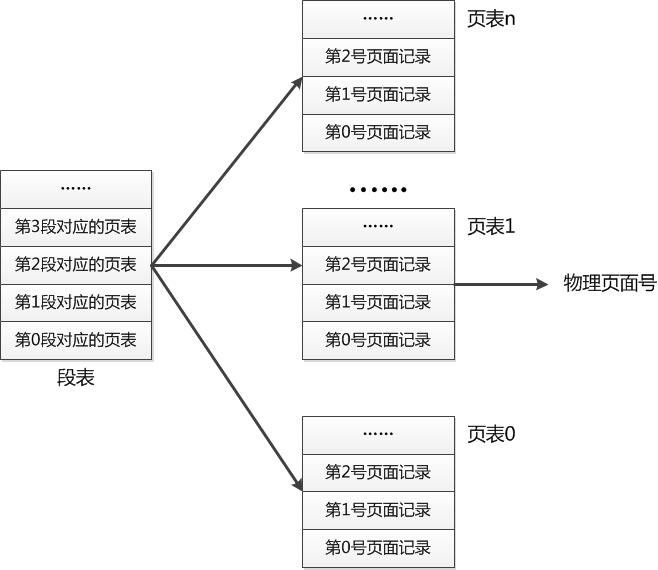

# 内存管理

## 内存管理方式

### 块式/分区管理

把主存分为一块一块的，当所需的程序片段不再主存时就分配一块主存空间，把程序加载入主存，就算所需的程序片段只有几个字节也只能把这一块都分给他。

#### 优点

易于管理和实现。

#### 缺点

很浪费很多内存。

### 页式管理

将程序的逻辑地址空间划分为固定大小的页(page)，而物理内存划分为同样大小的页框(page frame)。

#### 页式管理的数据结构

在页式系统中进程建立时，操作系统为进程中所有的页分配页框。当进程撤销时收回所有分配给它的页框。在程序的运行期间，如果允许进程动态地申请空间，操作系统还要为进程申请的空间分配物理页框。操作系统为了完成这些功能，必须记录系统内存中实际的页框使用情况。操作系统还要在进程切换时，正确地切换两个不同的进程地址空间到物理内存空间的映射。这就要求操作系统要记录每个进程页表的相关信息。为了完成上述的功能，—个页式系统中，一般要采用如下的数据结构。

- **进程页表**：完成逻辑页号(本进程的地址空间)到物理页面号(实际内存空间，也叫块号)的映射。
每个进程有一个页表，描述该进程占用的物理页面及逻辑排列顺序，如图：

- **物理页面表**：整个系统有一个物理页面表，描述物理内存空间的分配使用状况，其数据结构可采用位示图和空闲页链表。

- **请求表**：整个系统有一个请求表，描述系统内各个进程页表的位置和大小，用于地址转换也可以结合到各进程的PCB(进程控制块)里。

#### 页式管理地址变换
  
在页式系统中，指令所给出的地址分为两部分：逻辑页号和页内地址。

原理：CPU中的内存管理单元(MMU)按逻辑页号通过查进程页表得到物理页框号，将物理页框号与页内地址相加形成物理地址(见图4-4)。

逻辑页号，页内偏移地址－>查进程页表，得物理页号－>物理地址：

上述过程通常由处理器的硬件直接完成，不需要软件参与。通常，操作系统只需在进程切换时，把进程页表的首地址装入处理器特定的寄存器中即可。一般来说，页表存储在主存之中。这样处理器每访问一个在内存中的操作数，就要访问两次内存：

第一次用来查找页表将操作数的 逻辑地址变换为物理地址；
第二次完成真正的读写操作。

这样做时间上耗费严重。为缩短查找时间，可以将页表从内存装入CPU内部的关联存储器(例如，快表) 中，实现按内容查找。此时的地址变换过程是：在CPU给出有效地址后，由地址变换机构自动将页号送人快表，并将此页号与快表中的所有页号进行比较，而且这 种比较是同时进行的。若其中有与此相匹配的页号，表示要访问的页的页表项在快表中。于是可直接读出该页所对应的物理页号，这样就无需访问内存中的页表。由于关联存储器的访问速度比内存的访问速度快得多。

#### 优点

内存空间利用率高，不会产生外部碎片，只会有少量的页内碎片。

#### 缺点

不方便按照逻辑模块实现信息的共享和保护。

### 段式管理

分段管理就是将一个程序按照逻辑单元分成多个程序段，每一个段使用自己单独的虚拟地址空间。例如，对于编译器来说，我们可以给其5个段，占用5个虚拟地址空间，如下图所示：

#### 优点

1. 每个逻辑单元可单独占用一个虚拟地址空间，这样使得编写程序的空间大为增长。
2. 由于段式按逻辑关系划分，因此共享起来十分方便。
3. 对于空间稀疏的程序来说，分段管理将节省大量的空间。

#### 缺点

外部碎片和一个段必须全部加载到内存。

### 段页式管理

段页式管理就是将程序分为多个逻辑段，在每个段里面又进行分页，即将分段和分页组合起来使用。这样做的目的就是想同时获得分段和分页的好处，但又避免了单独分段或单独分页的缺陷。

如果我们将每个段看做一个单独的程序，则逻辑分段就相当于同时加载多个程序。

#### 段页式内存管理的实现

采用多级页表，顶级为段表，次级为页表。由段号在段表里面获得所应该使用的页表，然后在该页表里面查找物理页面号，如下图所示：

#### 优点

保留了分段和请求分页存储管理的全部优点，提供了虚存空间，能更有效利用主存。

#### 缺点

增加了硬件成本，系统复杂度较大。

## 多级页表

使用多级页表可以节省内存空间，在内存寻址的时候需要查询页表找到对应的物理内存地址。需要先通过页地址进行查找，找到起始地址，再通过偏移量找到物理地址。由于操作系统的地址空间一般是未使用的，用于栈和堆增长时使用。所以这时候就没必要保存这段空间的页表。使用二级页表在查询的时候后，查到这一段就直接标记为未使用，这样就不用加载这段的一级页表了。

## 快表

缓存物理地址的映射对。

## 引用

1. [操作系统核心原理-5.内存管理（下）：段式内存管理](https://www.cnblogs.com/edisonchou/p/5115242.html)
1. [操作系统内存管理](https://blog.csdn.net/hguisu/article/details/5713164)