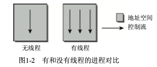

# 简介和概述

## 目录

[进程、进程切换、调度](#进程、进程切换、调度)

## 内核的任务

内核是硬件与软件之间的一个中间层。其作用是将程序的请求传递给硬件，并充当底层驱动程序，对硬件进行寻址。

### 从其他角度理解内核

- 内核抽象了与硬件交互的细节，程序只需要向内核发送请求。
- 可以将内核视为资源管理程序，内核将cpu时间、磁盘空间等分配给程序，并保证系统的完整性。
- 内核是一个库，给程序提供了一组面向系统的命令。

## 内核实现策略

1. 微内核
    内核只实现最基础的功能，如：基本的内存分配和进程调度。其他比如文件系统等由独立的进程实现。这种实现方式需要额外的cpu时间，所以目前实用性不高。
2. 宏内核
    内核的全部代码，包括所有的子系统（如内存管理、文件系统、设备驱程序）都打包到一个文件中。linux目前采用这种方式，但支持模块的动态添加和移除。

## 内核的组成部分

### 进程、进程切换、调度

1. 内核借助于cpu的帮助，通过在撤销进程的cpu资源之前保存进程的所有与状态相关的要素，并将进程置于空闲状态，在重新激活进程时，则将保存的状态原样恢复。这个过程称为进程切换。
2. 内核确定哪个进程运行的时间长短的过程称为调度。

### UNIX进程

1. 线程
    进程并不是内核支持的唯一一种程序执行形式。除了重量级进程(有时也称为UNIX进程)之外， 还有一种形式是线程(有时也称为轻量级进程)。线程也已经出现相当长的一段时间，本质上一个进 程可能由若干线程组成，这些线程共享同样的数据和资源，但可能执行程序中不同的代码路径。由于 线程和主程序共享同样的地址空间，主程序自动就可以访问接收到的数据。因此除了为防止线程访问 同一内存区而采取的互斥机制外，就不需要什么通信了。
    
2. [命名空间](../命名空间.md)
    每个命名空间可以包含一个特定的 PID集合，或可以提供文件系统的不同视图，在某个命名空间中挂载的卷不会传播到其他命名空间中。

### 地址空间与特权

#### 地址空间

#### 特权级别

不同级别拥有不用的权限

- 内核态
- 用户态

### 页表

### 物理内存的分配

#### 伙伴系统

系统中的空闲内存块总是两两分组，每组中的两个内存块称作伙伴。伙伴的分配可以是彼此独立 的。但如果两个伙伴都是空闲的，内核会将其合并为一个更大的内存块，作为下一层次上某个内存块的伙伴。

#### slab缓存

内核本身经常需要比完整页帧小得多的内存块。由于内核无法使用标准库的函数，因而必须在伙伴系统基础上自行定义额外的内存管理层，将伙伴系统提供的页划分为更小的部分。该方法不仅可以分配内存，还为频繁使用的小对象实现了一个一般性的缓存——slab缓存。它可以用两种方法分配内存。

1. 对频繁使用的对象，内核定义了只包含了所需类型对象实例的缓存。每次需要某种对象时， 可以从对应的缓存快速分配(使用后释放到缓存)。slab缓存自动维护与伙伴系统的交互，在缓存用尽时会请求新的页帧。
1. 对通常情况下小内存块的分配，内核针对不同大小的对象定义了一组slab缓存，可以像用户空间编程一样，用相同的函数访问这些缓存。不同之处是这些函数都增加了前缀k，表明是与内核相关联的:kmalloc和kfree。

#### 页面交换和回收

页面交换通过利用磁盘空间作为扩展内存，从而增大了可用的内存。在内核需要更多内存时，不经常使用的页可以写入硬盘。如果再需要访问相关数据，内核会将相应的页切换回内存。通过缺页异常机制，这种切换操作对应用程序是透明的。换出的页可以通过特别的页表项标识。在进程试图访问此类页帧时，CPU则启动一个可以被内核截取的缺页异常。此时内核可以将硬盘上的数据切换到内存中。接下来用户进程可以恢复运行。由于进程无法感知到缺页异常，所以页的换入和换出对进程是完全不可见的。

页面回收用于将内存映射被修改的内容与底层的块设备同步，为此有时也简称为数据回写。数据 刷出后，内核即可将页帧用于其他用途(类似于页面交换)。内核的数据结构包含了与此相关的所有 信息，当再次需要该数据时，可根据相关信息从硬盘找到相应的数据并加载。

## 计时

## 系统调用

## 设备驱动程序、块设备和字符设备

## 网络

## 文件系统

## 模块和热插拔

## 缓存

##  链表处理

## 对象管理和引用计数

## 数据类型

### 类型定义

### [字节序](../../计算机系统/字节序.md)
