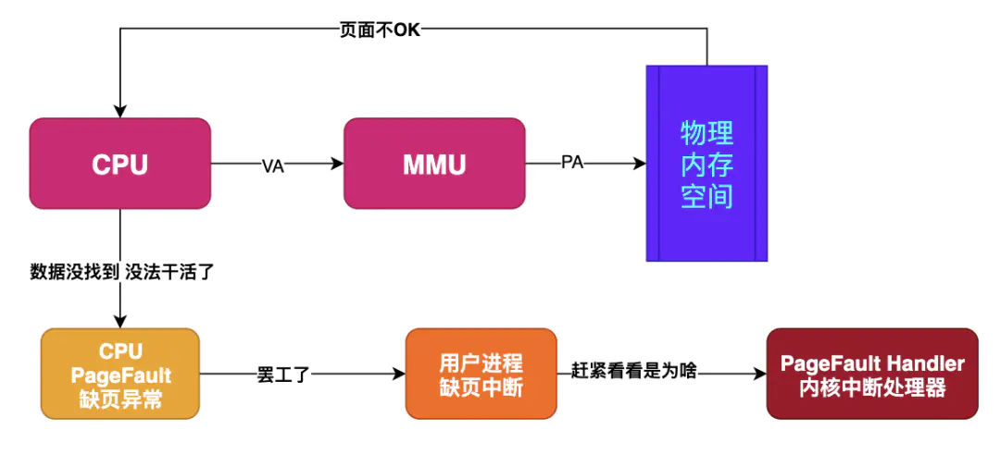
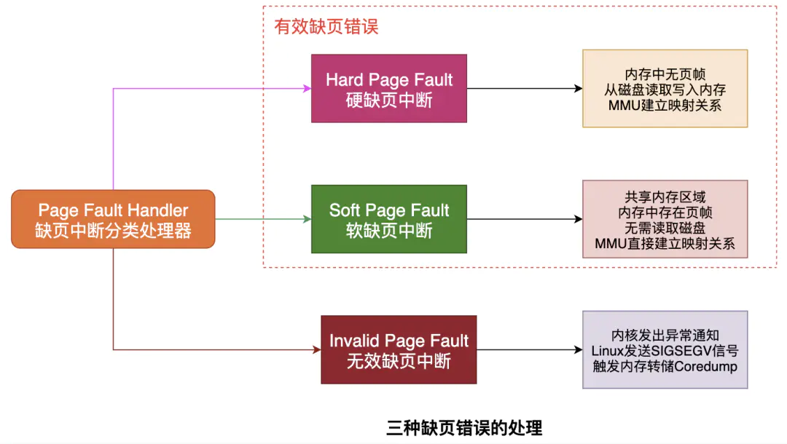

# 缺页异常

假如目标内存页在物理内存中没有对应的页帧或者存在但无对应权限，CPU 就无法获取数据，这种情况下CPU就会报告一个缺页错误。

## 异常处理

- **Hard Page Fault**
    也被称为Major Page Fault，翻译为硬缺页错误/主要缺页错误，这时物理内存中没有对应的页帧，需要CPU打开磁盘设备读取到物理内存中，再让MMU建立VA和PA的映射。
- **Soft Page Fault**
    也被称为Minor Page Fault，翻译为软缺页错误/次要缺页错误，这时物理内存中是存在对应页帧的，只不过可能是其他进程调入的，发出缺页异常的进程不知道而已，此时MMU只需要建立映射即可，无需从磁盘读取写入内存，一般出现在多进程共享内存区域。
- **Invalid Page Fault**
    翻译为无效缺页错误，比如进程访问的内存地址越界访问，又比如对空指针解引用内核就会报segment fault错误中断进程直接挂掉。

## 参考

- [什么是缺页错误Page Fault](https://juejin.cn/post/6846687586816098312)