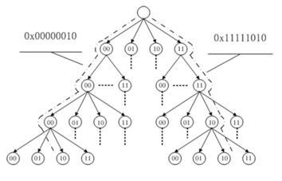

# radix tree

基数树，是将指针与long整数键值相关联的机制，它存储有效率，并且可快速查询，用于指针与整数值的映射（如：IDR机制）、内存管理等。

## Difference between radix tree and trie

A radix tree is a compressed version of a trie. In a trie, on each edge you write a single letter, while in a PATRICIA tree (or radix tree) you store whole words.

Now, assume you have the words hello, hat and have. To store them in a trie, it would look like:
```
    e - l - l - o
  /
h - a - t
      \
       v - e
```
And you need nine nodes. I have placed the letters in the nodes, but in fact they label the edges.

In a radix tree, you will have:
```
            *
           /
        (ello)
         /
* - h - * -(a) - * - (t) - *
                 \
                 (ve)
                   \
                    *
```
and you need only five nodes. In the picture above nodes are the asterisks.

So, overall, a radix tree takes less memory, but it is harder to implement. Otherwise the use case of both is pretty much the same.



## 引用

1. [stackoverflow: What is the difference between trie and radix trie data structures?](https://stackoverflow.com/questions/14708134/what-is-the-difference-between-trie-and-radix-trie-data-structures)