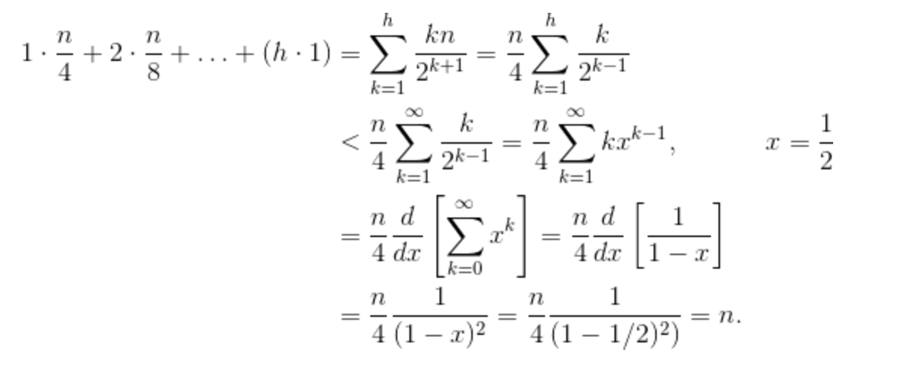

# 堆

堆(Heap)是计算机科学中一类特殊的数据结构的统称。堆通常是一个可以被看做一棵完全二叉树的数组对象。

## Abstract

In computer science, a heap is a specialized tree-based data structure which is essentially an almost complete tree that satisfies the heap property: in a max heap, for any given node C, if P is a parent node of C, then the key (the value) of P is greater than or equal to the key of C. In a min heap, the key of P is less than or equal to the key of C. The node at the "top" of the heap (with no parents) is called the root node.

## Binary Heap

A binary heap is a heap data structure that takes the form of a binary tree. Binary heaps are a common way of implementing priority queues.:162–163 The binary heap was introduced by J. W. J. Williams in 1964, as a data structure for heapsort.

A binary heap is defined as a binary tree with two additional constraints:

1. Shape property: a binary heap is a complete binary tree; that is, all levels of the tree, except possibly the last one (deepest) are fully filled, and, if the last level of the tree is not complete, the nodes of that level are filled from left to right.
1. Heap property: the key stored in each node is either greater than or equal to (≥) or less than or equal to (≤) the keys in the node's children, according to some total order.

Heaps where the parent key is greater than or equal to (≥) the child keys are called **max-heaps**; those where it is less than or equal to (≤) are called **min-heaps**. Efficient (logarithmic time) algorithms are known for the two operations needed to implement a priority queue on a binary heap: inserting an element, and removing the smallest or largest element from a min-heap or max-heap, respectively. Binary heaps are also commonly employed in the heapsort sorting algorithm, which is an in-place algorithm because binary heaps can be implemented as an implicit data structure, storing keys in an array and using their relative positions within that array to represent child-parent relationships.

### Binary Heap implementation

Heaps are commonly implemented with an array. Any binary tree can be stored in an array, but because a binary heap is always a complete binary tree, it can be stored compactly. No space is required for pointers; instead, the parent and children of each node can be found by arithmetic on array indices. 

Let n be the number of elements in the heap and i be an arbitrary valid index of the array storing the heap. If the tree root is at index 0, with valid indices 0 through n − 1, then each element a at index i has
- children at indices 2i + 1 and 2i + 2
- its parent at index floor((i − 1) ∕ 2).

Alternatively, if the tree root is at index 1, with valid indices 1 through n, then each element a at index i has

- children at indices 2i and 2i +1
- its parent at index floor(i ∕ 2).

### Heap sort

#### Heap sort implementation

```
func heapSort(nums []int) {
	nLen := len(nums)
	if nLen < 2 {
		return
	}

	for i := nLen/2 - 1; i >= 0; i-- {
		heapify(nums, nLen, i)
	}

	nums[nLen-1], nums[0] = nums[0], nums[nLen-1]
	for i := nLen - 2; i >= 0; i-- {
		heapify(nums[:i+1], i+1, 0)
		nums[i], nums[0] = nums[0], nums[i]
	}
}

// heapify confirm
func heapify(nums []int, n, i int) {
	left := 2*i + 1
	right := 2*i + 2

	if right < n && nums[right] > nums[i] {
		nums[right], nums[i] = nums[i], nums[right]
		heapify(nums, n, right)
	}

	if left < n && nums[left] > nums[i] {
		nums[left], nums[i] = nums[i], nums[left]
		heapify(nums, n, left)
	}
}

```

#### Time Complexity of Building a Heap and Heap Sort

- **siftDown**: swaps a node that is too small with its largest child (thereby moving it down) until it is at least as large as both nodes below it.
- **siftUp**: swaps a node that is too large with its parent (there by moving it up) until it is no larger than the node above it.

##### build Heap:

n: the total count of nodes in this heap
h: the height of the heap
h = log n

##### sift down: 

(0 * n/2) + (1 * n/4) + (2 * n/8) + ... + (h * 1) 



##### sift up:

(h * n/2) + ((h-1) * n/4) + ((h-2) * n/8) + ... (0 * 1)

##### Heap sort								

```
for i := n-1; i > 0; i-- {
    arr[i] = deleteMax()
}
```

Clearly, the loop runs O(n) times (n -1 to be precise, the last item is already in place). The complexity of deleteMax for a heap is  O(log n). 

### Applications

- Priority Queue: Priority queue can be effciently implemented using Binary Heap because it supports insert(), delete() and extractmax(), decreseKey() operations in O(log n) time comlexity.
- Order Statistics: The Heap data structure can be used to efficiently find the kth smallest (or largest) element in an array. Using Max Heap to get  k maximum elements from  the Max Heap O(k log n ).

## 引用

1. [stackoverflow: How can building a heap be O(n) time complexity?](https://stackoverflow.com/questions/9755721/how-can-building-a-heap-be-on-time-complexity)
1. [Wikipedia: Heap (data structure)](https://en.wikipedia.org/wiki/Heap_(data_structure))
1. [Wikipedia: Binary heap](https://en.wikipedia.org/wiki/Binary_heap)