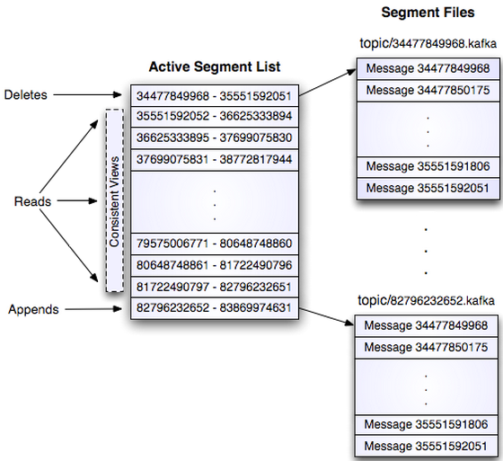
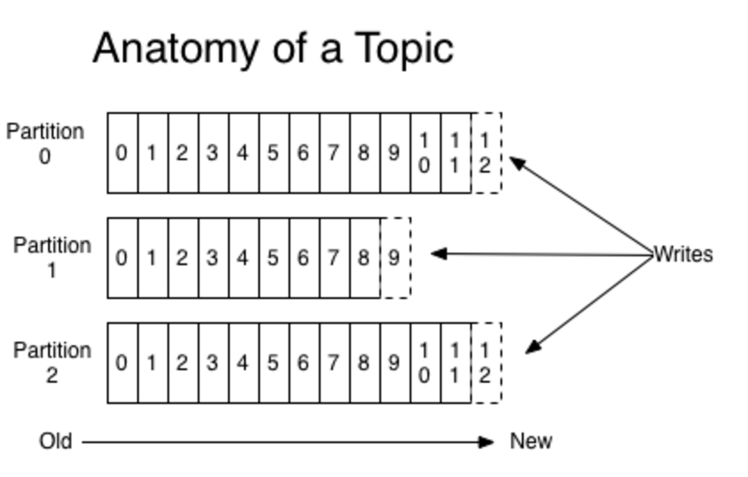

# kafaka 基本概念

## 基本组件

### Broker ［中间者，代理者］

Kafka集群包含多台服务器，一台Kafka服务器就是一个Broker，一个集群由多个broker组成，一个broker可以有多个topic。broker承担着中间缓存和分发的作用，broker将producer发送的数据分发到注册consumer中

### Topic ［主题，类别，话题］

topic，我们可以理解为是一种队列，每条发送消息都从属于一种类别，这种类别在kafka中被设计为一个topic，比如：用户信息类的消息的topic，我们定义为user-topic，那么凡是用户信息类的消息都将发送到这个topic中，从而我们所要处理用户信息类的消费者就可以从这topic中拉取。

### Producer［生产者］

producer是生产者，意在向Topic中发送消息的一方

### Consumer ［消费者］

consumer是消费者，意在向Topic中拉取／消费消息的一方
Kafka拓扑结构

### Replications［备份，复制］

分区的备份，以便容错，分布在其他broker上，每个broker上只能有0个或者1个replications

### Consumer Group［消费者群组］

消费者群组，是有若干个消费者组成的集体，每个consumer属于一个特定的consumer group，kafka采用将Consumer分组的方式实现一个主题（topic）的消息和广播（发给所有的consumer）和单播（发给单个的consumer）

### Partition ［分区］

Kafka内在就是分布式的，一个broker中可以有多个topic，一个topic可以设置多个partition（分区），每个Partition在物理上都对应一个文件夹，该文件夹存储这个Partition的所有消息和索引文件。Partition中的消息都会被分配为一个有序的ID（offset）,一个partition对应多个Segment，每个Segment对应一个文件，Segment由一个个的不可变记录组成，该记录只会append到Segment中，不会单独的修改或者删除，可以设置Segment根据时间或者大小来定时删除文件。默认是根据大小128MB，当segment大小达到128MB时，则会删除一些Segment文件（这里有一点，删除的时候，会选择一个或者多个Segment来删除，也就是说删除三个Segment大小可能大于128MB，但是不会是小于128MB）

### offset［偏移］

在每个partition分区下的消息都是顺序保存的，kakfa使用一个唯一的标识来记录它们在该分区下的位置，这个位置标识被称为offset（位移），位移是顺序递增的，一旦确定下来之后就不能修改。Kafka会维护分区下的消息顺序，但是不会维护跨partition（分区）间的顺序（假如，我们往topic1分别发送三条消息1，2，3 那么，1和3发送到了partition1中，2发送到了partition2中，那么kafka consumer在消费时，会按照1 然后 3的顺序消息，但是不保证 2 会在消费1之后在消费 ）
　　那么我们知道了topic，partition和offset信息，我们就能唯一定位一条消息。所以说每条Kafka的消息本质上都是一个三元组(tuple)：<topic, partition, offset>。我们可以称该三元组为消息的元数据(message metadata)。它们之间的关系如下图所示：

## 引用

1. [kafka 基础知识整理（一）- 概述](https://www.jianshu.com/p/6b9fa8891026)