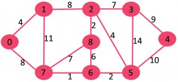
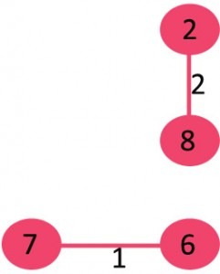
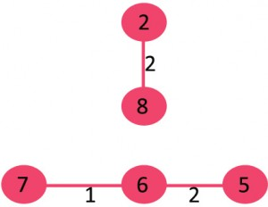
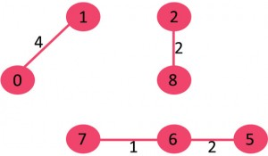
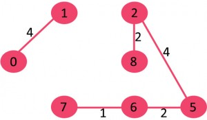
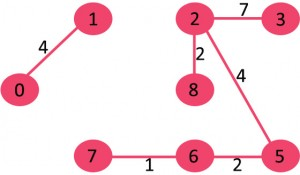
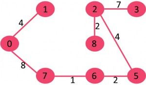
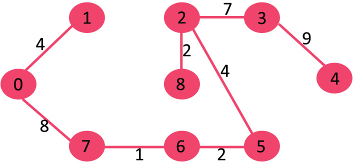

# Kruskal (克鲁斯克尔 最小生成树)

Kruskal's algorithm is a **minimum-spanning-tree** algorithm which finds an edge of the least possible weight that connects any two trees in the forest. It is a **greedy algorithm** in graph theory as it finds a minimum spanning tree for a connected weighted graph adding increasing cost arcs at each step. This means it finds a subset of the edges that forms a tree that includes every vertex, where the total weight of all the edges in the tree is minimized. If the graph is not connected, then it finds a minimum spanning forest (a minimum spanning tree for each connected component).

## Implementation

1. Sort all the edges in non-decreasing order of their weight.
2. Pick the smallest edge. Check if it forms a cycle with the spanning tree formed so far. If cycle is not formed, include this edge. Else, discard it.
3. Repeat step#2 until there are (V-1) edges in the spanning tree.

### Example

Let us understand it with an example: Consider the below input graph.



The graph contains 9 vertices and 14 edges. So, the minimum spanning tree formed will be having (9 – 1) = 8 edges.

Now pick all edges one by one from sorted list of edges

1. Pick edge 7-6: No cycle is formed, include it.


2. Pick edge 8-2: No cycle is formed, include it.



3. Pick edge 6-5: No cycle is formed, include it.



4. Pick edge 0-1: No cycle is formed, include it.



5. Pick edge 2-5: No cycle is formed, include it.



6. Pick edge 8-6: Since including this edge results in cycle, discard it.
7. Pick edge 2-3: No cycle is formed, include it.



8. Pick edge 7-8: Since including this edge results in cycle, discard it.
9. Pick edge 0-7: No cycle is formed, include it.



10. Pick edge 1-2: Since including this edge results in cycle, discard it.
11. Pick edge 3-4: No cycle is formed, include it.



Since the number of edges included equals (V – 1), the algorithm stops here.

### Code

```
type DisjointSet struct {
	ranks []int
	subsets []int
}

func (d *DisjointSet) Constructor (cnt int) {
	d.ranks = make([]int, cnt)
	d.subsets = make([]int, cnt)
	for i := 0; i < cnt; i++ {
		d.ranks[i] = 1
		d.subsets[i] = i
	}
}

func (d *DisjointSet) Find(i int) int {
	if d.subsets[i] != i {
		d.subsets[i] = d.Find(d.subsets[i])
	}
	return d.subsets[i]
}

func (d *DisjointSet) Union(i, j int) {
	rooti := d.Find(i)
	rootj := d.Find(j)

	if rooti == rootj {
		return
	}

	if d.ranks[rooti] <= d.ranks[rootj] {
		d.subsets[rooti] = rootj
		if d.ranks[rooti] == d.ranks[rootj] {
			d.ranks[rootj]++
		}
	} else if d.ranks[rooti] > d.ranks[rootj] {
		d.subsets[rootj] = rooti
	}
}

type Edge struct {
	src    int
	dst    int
	weight int
}

type Graph struct {
	V, E  int
	Edges []Edge
}

func kruskal(g Graph) Graph {
	sortEdges(g.Edges)

	var retg Graph
	retg.V = g.V
	
	disjointset := new(DisjointSet)
	disjointset.Constructor(g.V)
	
	for i := 0; i < g.E; i++ {
		roots := disjointset.Find(g.Edges[i].src)
		rootd := disjointset.Find(g.Edges[i].dst)

		if roots == rootd {
			continue
		}

		disjointset.Union(roots, rootd)
		retg.Edges = append(retg.Edges, g.Edges[i])
		retg.E++
	}

	return retg
}

func sortEdges(edges []Edge) {
	l := len(edges)
	if l <= 1 {
		return
	}
	newedges := make([]Edge, l)

	left, right := 0, l-1
	for i := 1; i < l; i++ {
		if edges[i].weight > edges[0].weight {
			newedges[right] = edges[i]
			right--
		} else if edges[i].weight < edges[0].weight {
			newedges[left] = edges[i]
			left++
		}
	}
	for i := left; i <= right; i++ {
		newedges[i] = edges[0]
	}

	copy(edges, newedges)
	sortEdges(edges[: left])
	if right < l-1 {
		sortEdges(edges[right+1: ])
	}
}
```

## Reference

1. [Wikipedia: Kruskal's algorithm](https://en.wikipedia.org/wiki/Kruskal%27s_algorithm)
1. [GeeksforGeeks: Kruskal’s Minimum Spanning Tree Algorithm | Greedy Algo-2](https://www.geeksforgeeks.org/kruskals-minimum-spanning-tree-algorithm-greedy-algo-2/)
1. [Wikipedia: Disjoint-set data structure](https://en.wikipedia.org/wiki/Disjoint-set_data_structure#Time_complexity)
1. [GeeksforGeeks: Disjoint Set (Or Union-Find) | Set 1 (Detect Cycle in an Undirected Graph))](https://www.geeksforgeeks.org/union-find/)
1. [GeeksforGeeks: Union-Find Algorithm | Set 2 (Union By Rank and Path Compression)](https://www.geeksforgeeks.org/union-find-algorithm-set-2-union-by-rank/)