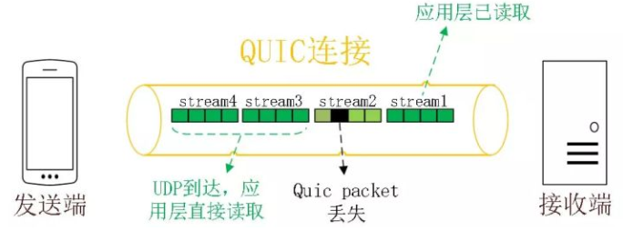
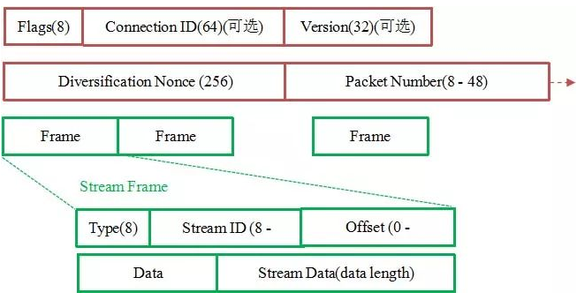

# HTTP3

## 新特性

### 0-RTT

通过使用类似 TCP 快速打开的技术，缓存当前会话的上下文，在下次恢复会话的时候，只需要将之前的缓存传递给服务端验证通过就可以进行传输了。0RTT 建连可以说是 QUIC 相比 HTTP2 最大的性能优势。

### 多路复用

同 HTTP2.0 一样，同一条 QUIC 连接上可以创建多个 stream，来发送多个 HTTP 请求，但是，QUIC 是基于 UDP 的，一个连接上的多个 stream 之间没有依赖。比如下图中 stream2 丢了一个 UDP 包，不会影响后面跟着 Stream3 和 Stream4，不存在 TCP 队头阻塞。虽然 stream2 的那个包需要重新传，但是 stream3、stream4 的包无需等待，就可以发给用户。

### 加密认证的报文
TCP 协议头部没有经过任何加密和认证，所以在传输过程中很容易被中间网络设备篡改，注入和窃听。比如修改序列号、滑动窗口。这些行为有可能是出于性能优化，也有可能是主动攻击。

但是 QUIC 的 packet 可以说是武装到了牙齿。除了个别报文比如 PUBLIC_RESET 和 CHLO，所有报文头部都是经过认证的，报文 Body 都是经过加密的。

这样只要对 QUIC 报文任何修改，接收端都能够及时发现，有效地降低了安全风险。

### 向前纠错机制

QUIC 协议有一个非常独特的特性，称为向前纠错 (Forward Error Correction，FEC)，每个数据包除了它本身的内容之外，还包括了部分其他数据包的数据，因此少量的丢包可以通过其他包的冗余数据直接组装而无需重传。向前纠错牺牲了每个数据包可以发送数据的上限，但是减少了因为丢包导致的数据重传，因为数据重传将会消耗更多的时间(包括确认数据包丢失、请求重传、等待新数据包等步骤的时间消耗)

假如说这次我要发送三个包，那么协议会算出这三个包的异或值并单独发出一个校验包，也就是总共发出了四个包。当出现其中的非校验包丢包的情况时，可以通过另外三个包计算出丢失的数据包的内容。当然这种技术只能使用在丢失一个包的情况下，如果出现丢失多个包就不能使用纠错机制了，只能使用重传的方式了。

## 引用

1. [一文读懂 HTTP/2 及 HTTP/3 特性](https://blog.fundebug.com/2019/03/07/understand-http2-and-http3/)
