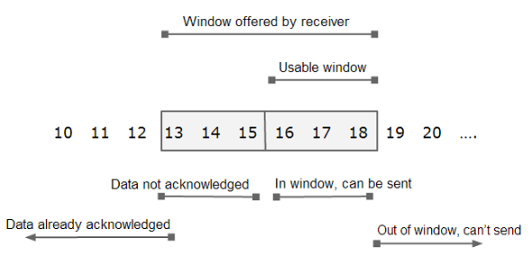
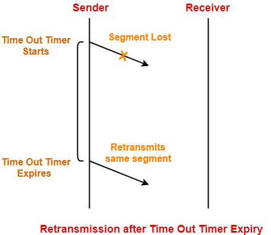
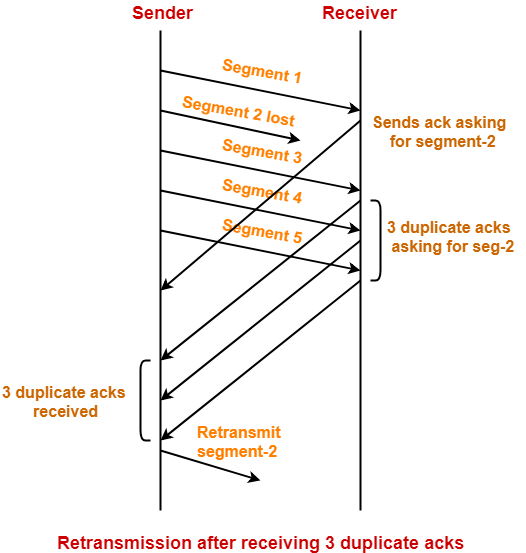
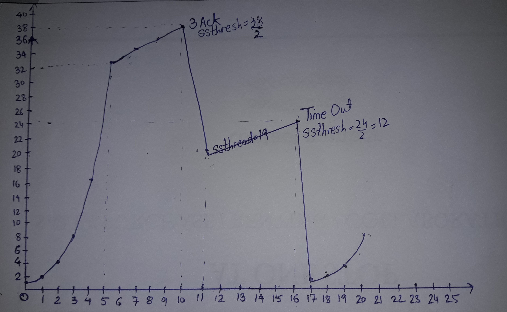

## 滑动窗口

The process described in last section is good on receiver’s part but sender has to maintain a window on its side too. This window covers unacknowledged data and the data it can send keeping in mind the window size advertised by the receiver.

Following figure should give you an idea about how a sliding window looks like :



In the figure shown above :

1. The available window advertised by the receiver is 6. This means that receiver can accept 6 bytes as of now.
1. The window at sender side covers bytes ranging from 13 to 18 (I.e. 6 bytes in total).
1. Out of this range, 13-15 are the bytes which have been sent but no acknowledgement is yet received for them.
1. Bytes 16-18 are the bytes that sender can send as soon as possible.
1. If sender starts receiving acknowledgement for bytes 13 to 15, the left end of the window starts closing in.
1. The right end starts opening up as more and more window size is advertised by the receiver.
1. This window slides towards right depending upon how fast receiver consumes data and sends acknowledgement and hence known as sliding window.
1. The receiver can send acknowledgement even before its window fills up completely.
1. The left edge of the window can move towards right.
1. Neither left edge should move towards left nor right edge should move towards left.

## Retransmission

Sender starts transmitting TCP segments to the receiver. A TCP segment sent by the sender may get lost on the way before reaching the receiver. This causes the receiver to send the acknowledgement with same ACK number to the sender. As a result, sender retransmits the same segment to the receiver. This is called as TCP retransmission.

Each time sender transmits a TCP segment to the receiver, it starts a Time Out Timer.

### Timer

Sender does not receives any acknowledgement for the sent segment and the timer goes off. In this case, sender assumes that the sent segment is lost. Sender retransmits the same segment to the receiver and resets the timer.



### Early retransmisson (Fase retransmission)

Consider sender receives three duplicate acknowledgements for a TCP segment sent by it. Then, sender assumes that the corresponding segment is lost. So, sender retransmits the same segment without waiting for its time out timer to expire. This is known as Early retransmission or Fast retransmission.



## Flow control

TCP uses a sliding window protocol to control the number of bytes in flight it can have. In other words, the number of bytes that were sent but not yet acked.

Let’s say we want to send a 150000 bytes file from node A to node B. TCP could break this file down into 100 packets, 1500 bytes each. Now let’s say that when the connection between node A and B is established, node B advertises a receive window of 45000 bytes, because it really wants to help us with our math here.

Seeing that, TCP knows it can send the first 30 packets (1500 * 30 = 45000) before it receives an acknowledgment. If it gets an ack message for the first 10 packets (meaning we now have only 20 packets in flight), and the receive window present in these ack messages is still 45000, it can send the next 10 packets, bringing the number of packets in flight back to 30, that is the limit defined by the receive window. In other words, at any given point in time it can have 30 packets in flight, that were sent but not yet acked.


Example of a sliding window. As soon as packet 3 is acked, we can slide the window to the right and send the packet 8.

Now, if for some reason the application reading these packets in node B slows down, TCP will still ack the packets that were correctly received, but as these packets need to be stored in the receive buffer until the application decides to read them, the receive window will be smaller, so even if TCP receives the acknowledgment for the next 10 packets (meaning there are currently 20 packets, or 30000 bytes, in flight), but the receive window value received in this ack is now 30000 (instead of 45000), it will not send more packets, as the number of bytes in flight is already equal to the latest receive window advertised.

## Congestion Controll

TCP uses a congestion window and a congestion policy that avoid congestion.Previously, we assumed that only receiver can dictate the sender’s window size. We ignored another entity here, the network. If the network cannot deliver the data as fast as it is created by the sender, it must tell the sender to slow down. In other words, in addition to the receiver, the network is a second entity that determines the size of the sender’s window.

### Congestion policy in TCP

Slow Start Phase: starts slowly increment is exponential to threshold
Congestion Avoidance Phase: After reaching the threshold increment is by 1
Congestion Detection Phase: Sender goes back to Slow start phase or Congestion avoidance phase.

### Slow Start Phase

exponential increment – In this phase after every RTT the congestion window size increments exponentially.

```
Initially cwnd = 1
After 1 RTT, cwnd = 2^(1) = 2
2 RTT, cwnd = 2^(2) = 4
3 RTT, cwnd = 2^(3) = 8
```

### Congestion Avoidance Phase

additive increment – This phase starts after the threshold value also denoted as ssthresh. The size of cwnd(congestion window) increases additive. After each RTT cwnd = cwnd + 1.

```
Initially cwnd = i
After 1 RTT, cwnd = i+1
2 RTT, cwnd = i+2
3 RTT, cwnd = i+3
```

### Example 

Assume a TCP protocol experiencing the behavior of slow start. At 5th transmission round with a threshold (ssthresh) value of 32 goes into congestion avoidance phase and continues till 10th transmission. At 10th transmission round, 3 duplicate ACKs are received by the receiver and enter into additive increase mode. Timeout occurs at 16th transmission round. Plot the transmission round (time) vs congestion window size of TCP segments.



## 引用

1. [cnblogs: TCP 协议如何保证可靠传输](https://www.cnblogs.com/deliver/p/5471231.html)
1. [TheGeekStuff: What is TCP Sliding Window? How does it Work?](https://www.thegeekstuff.com/2013/10/tcp-sliding-window/)
1. [GateVidyalay: TCP Retransmission | TCP Duplicate ACK](https://www.gatevidyalay.com/tcp-retransmission-tcp-computer-networks/)
1. [Brianstorti: TCP Flow Control](https://www.brianstorti.com/tcp-flow-control/)
1. [GeeksforGeeks: TCP Congestion Control](https://www.geeksforgeeks.org/tcp-congestion-control/)