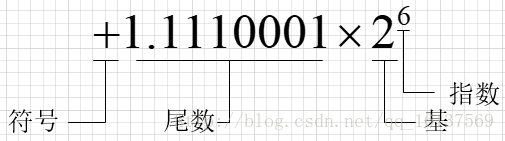

# float and double

**float** is a 32 bit IEEE 754 single precision Floating Point Number1 bit for the sign, (8 bits for the exponent, and 23* for the value), i.e. float has 7 decimal digits of precision.

**double** is a 64 bit IEEE 754 double precision Floating Point Number (1 bit for the sign, 11 bits for the exponent, and 52* bits for the value), i.e. double has 15 decimal digits of precision.

## 引用

1. [GeeksforGeeks: Difference between float and double in C/C++](https://www.geeksforgeeks.org/difference-float-double-c-cpp/)
