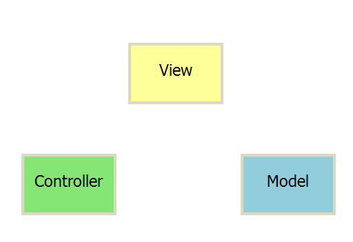

MVC 模式的意思是，软件可分成三个部分。

- **视图（View）**：用户界面
- **控制器（Controller）**：业务逻辑
- **模型（Model）**：数据保存

各部分之间的通信如下。

1. View 传送指令到 Controller
1. Controller 完成业务逻辑后， 要求 Model 改变
2. Model 将新的数据发送到 View，用户得到反馈

所有通信都是单向的。

### 互动模式

接受用户指令时，MVC 可以分成两种方式。一种是通过 View 接受指令，传递给 Controller。

另一种是直接通过 Controller 接受指令。

### 实例：Backbone

实际项目采用更灵活的方式，以 Backbone.js 为例

### Reference

1. [阮一峰的网络日志：MVC，MVP 和 MVVM 的图示](https://www.ruanyifeng.com/blog/2015/02/mvcmvp_mvvm.html)